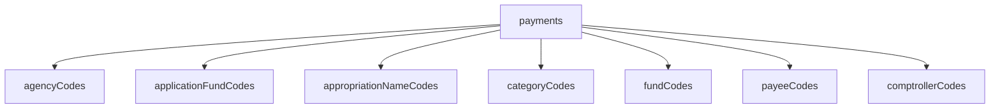

# TexasDOGE Database Schema

This document outlines the schema of the `texasDOGE` Supabase database. The central table in this database is `payments`, which records financial transactions. Several other tables provide descriptive information for the codes used in the `payments` table.

## Table Relationships

The following diagram illustrates the relationships between the `payments` table and the other tables in the database.

## Table Schemas and Connections

### `payments`

This is the main transactional table.

| Column                    | Data Type | Description                                       |
| ------------------------- | --------- | ------------------------------------------------- |
| `key`                     | bigint    | Primary Key                                       |
| `CatCode`                 | bigint    | Foreign key to `categoryCodes.CatCode`            |
| `Agency_CD`               | bigint    | Foreign key to `agencyCodes.Agency_CD`            |
| `Appd_Fund_Num`           | bigint    | Foreign key to `applicationFundCodes.Appd_Fund_Num` |
| `Fund_Num`                | bigint    | Foreign key to `fundCodes.Fund_Num`               |
| `Comptroller_Object_Num`  | bigint    | Foreign key to `comptrollerCodes.Comptroller_Object_Num` |
| `Appropriation_Number`    | bigint    | Foreign key to `appropriationNameCodes.Appropriation_Number` |
| `Amount`                  | bigint    | The transaction amount                            |
| `date`                    | date      | The date of the transaction                       |
| `Payee_id`                | bigint    | Foreign key to `payeeCodes.Payee_id`              |

**Example Row:**

| key | CatCode | Agency_CD | Appd_Fund_Num | Fund_Num | Comptroller_Object_Num | Appropriation_Number | Amount | date       | Payee_id |
| --- | ------- | --------- | ------------- | -------- | ---------------------- | -------------------- | ------ | ---------- | -------- |
| 1   | 5       | 529       | 5040          | 5040     | 7664                   | 13315                | 210910 | 2022-08-12 | 0        |

This row represents a payment of **$210,910** made on **August 12, 2022**. The following sections describe the connected data from other tables.

---

### `agencyCodes`

Provides the name of the agency associated with the transaction.

| Column      | Data Type | Description         |
| ----------- | --------- | ------------------- |
| `key`       | text      | Primary Key         |
| `Agency_CD` | bigint    | Agency Code         |
| `Agency_Name` | text      | Name of the Agency |

**Connection:** `payments.Agency_CD` -> `agencyCodes.Agency_CD`

**Example:** For `Agency_CD` = `529`, the `Agency_Name` is **Health and Human Services Commission**.

---

### `applicationFundCodes`

Provides the name of the applied fund.

| Column               | Data Type | Description      |
| -------------------- | --------- | ---------------- |
| `key`                | text      | Primary Key      |
| `Appd_Fund_Num`      | bigint    | Applied Fund Number |
| `Appd_Fund_Num_Name` | text      | Name of the Applied Fund |

**Connection:** `payments.Appd_Fund_Num` -> `applicationFundCodes.Appd_Fund_Num`

**Example:** For `Appd_Fund_Num` = `5040`, the `Appd_Fund_Num_Name` is **5040 - Gr Acct-Tobacco Settlement**.

---

### `appropriationNameCodes`

Provides the name of the appropriation.

| Column               | Data Type | Description         |
| -------------------- | --------- | ------------------- |
| `key`                | text      | Primary Key         |
| `Appropriation_Number` | text      | Appropriation Number|
| `Appropriation_Name` | text      | Name of the Appropriation |

**Connection:** `payments.Appropriation_Number` -> `appropriationNameCodes.Appropriation_Number`

**Example:** For `Appropriation_Number` = `13315`, the `Appropriation_Name` is **Chip Dental Services**.

---

### `categoryCodes`

Provides the category of the payment.

| Column   | Data Type | Description     |
| -------- | --------- | --------------- |
| `key`    | text      | Primary Key     |
| `CatCode`  | text      | Category Code   |
| `Category` | text      | Name of the Category |

**Connection:** `payments.CatCode` -> `categoryCodes.CatCode`

**Example:** For `CatCode` = `5`, the `Category` is **Public Assistance Payments**.

---

### `fundCodes`

Provides the description of the fund.

| Column           | Data Type | Description      |
| ---------------- | --------- | ---------------- |
| `key`            | text      | Primary Key      |
| `Fund_Num`       | bigint    | Fund Number      |
| `Fund_Description` | text      | Fund Description |

**Connection:** `payments.Fund_Num` -> `fundCodes.Fund_Num`

**Example:** For `Fund_Num` = `5040`, the `Fund_Description` is **Gr Account-Tobacco Settlement**.

---

### `comptrollerCodes`

Provides the name and description of the comptroller object.

| Column                    | Data Type | Description                |
| ------------------------- | --------- | -------------------------- |
| `key`                     | bigint    | Primary Key                |
| `Comptroller_Object_Num`  | bigint    | Comptroller Object Number  |
| `Comptroller_Object_Name` | text      | Comptroller Object Name    |

**Connection:** `payments.Comptroller_Object_Num` -> `comptrollerCodes.Comptroller_Object_Num`

**Example:** For `Comptroller_Object_Num` = `7664`, the `Comptroller_Object_Name` is **Supplementary Medical Insurance Benefits**.

---

### `payeeCodes`

Provides the name of the payee.

| Column     | Data Type | Description |
| ---------- | --------- | ----------- |
| `Payee_id` | text      | Primary Key |
| `Payee_Name` | text      | Payee Name  |

**Connection:** `payments.Payee_id` -> `payeeCodes.Payee_id`

**Example:** For `Payee_id` = `0`, the `Payee_Name` is **Dentaquest Usa Insurance Company**.
