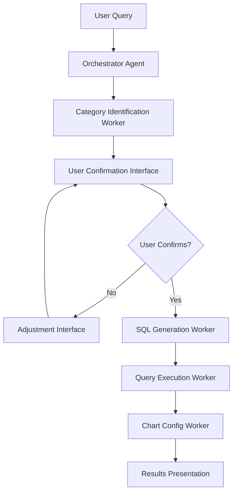

# SQL Data Analysis Agent Implementation Plan

## Overview
Build an AI agent for data analysis on the payments table using Vercel AI SDK's orchestrator-worker pattern with user confirmation workflows, following the Natural Language Postgres Guide best practices.

## Core Requirements
1. **Orchestrator Agent**: First identifies specific IDs for user requests using existing database code tools
2. **User Confirmation Loop**: Shows relevant results and gets user confirmation on categories
3. **Adjustable Selections**: Users can modify selections before proceeding
4. **Time-Based Analysis**: Default to monthly analysis if no time range specified
5. **SQL Query Generation**: Build and execute SQL queries against payments database
6. **Dual Visualization**: Present results in both table and chart formats

## Architecture Pattern: Orchestrator-Worker with Evaluator Loop



## Step-by-Step Implementation Plan

### Step 1: Enhanced Route Structure
**File**: `app/api/chat/route.ts`

#### 1.1 Multi-Step Agent Configuration
- Implement `maxSteps` parameter (set to 10-15 for complex workflows)
- Use structured outputs with answer tools for final responses
- Implement proper error handling and timeout management

#### 1.2 Agent State Management
- Track conversation state across multiple steps
- Implement session storage for user selections
- Handle concurrent user interactions

```typescript
export const maxDuration = 60; // Extended for complex analysis

export async function POST(req: Request) {
  const { messages, sessionId } = await req.json();
  
  const result = await streamText({
    model: openai('gpt-4o'),
    maxSteps: 12,
    system: ORCHESTRATOR_SYSTEM_PROMPT,
    messages,
    tools: {
      // Orchestration tools
      identifyCategories: identifyCategoriesAgent,
      confirmUserSelection: confirmUserSelectionTool,
      generateSQLQuery: generateSQLQueryAgent,
      executeQuery: executeQueryAgent,
      generateChartConfig: generateChartConfigAgent,
      // Existing database lookup tools
      ...existingDatabaseTools,
      // Final answer tool
      presentResults: presentResultsTool,
    },
  });
}
```

### Step 2: Orchestrator Agent Implementation

#### 2.1 Main Orchestrator System Prompt
```typescript
const ORCHESTRATOR_SYSTEM_PROMPT = `
You are a Texas government payments data analysis orchestrator. Your job is to coordinate multiple specialized agents to help users analyze payment data.

WORKFLOW:
1. First, understand what the user wants to analyze
2. Use database lookup tools to identify specific codes/IDs for entities mentioned
3. Present findings to user for confirmation with the confirmUserSelection tool
4. If user confirms, proceed with SQL analysis
5. If no time range specified, default to monthly analysis over available time period
6. Generate SQL queries for the payments table and related lookup tables
7. Execute queries and present results in both table and chart format

IMPORTANT: Always get explicit user confirmation before proceeding with data analysis.
`;
```

#### 2.2 Category Identification Worker
```typescript
const identifyCategoriesAgent = tool({
  description: 'Identify and look up specific category codes based on user query',
  parameters: z.object({
    userQuery: z.string(),
    entities: z.array(z.object({
      type: z.enum(['agency', 'fund', 'category', 'appropriation', 'payee', 'comptroller']),
      searchTerm: z.string(),
    })),
  }),
  execute: async ({ userQuery, entities }) => {
    // Use existing database lookup tools in parallel
    const lookupPromises = entities.map(async (entity) => {
      // Call appropriate lookup tool based on type
      // Return structured results
    });
    
    const results = await Promise.all(lookupPromises);
    return { foundEntities: results, needsConfirmation: true };
  },
});
```

### Step 3: User Confirmation System

#### 3.1 Selection Confirmation Tool
```typescript
const confirmUserSelectionTool = tool({
  description: 'Present findings to user and get confirmation',
  parameters: z.object({
    foundEntities: z.array(z.object({
      type: z.string(),
      options: z.array(z.object({
        id: z.union([z.string(), z.number()]),
        name: z.string(),
        description: z.string().optional(),
      })),
    })),
    recommendedSelections: z.array(z.object({
      type: z.string(),
      selectedId: z.union([z.string(), z.number()]),
      reason: z.string(),
    })),
  }),
  execute: async ({ foundEntities, recommendedSelections }) => {
    // Return structured confirmation request
    return {
      type: 'confirmation_required',
      message: 'I found the following entities for your analysis. Please confirm or adjust:',
      entities: foundEntities,
      recommendations: recommendedSelections,
      actions: ['confirm', 'adjust', 'cancel']
    };
  },
});
```

#### 3.2 Frontend Confirmation Interface
- Create React component for selection confirmation
- Allow users to modify selections with dropdowns/checkboxes
- Implement clear visual indicators for recommended vs. user-selected options

### Step 4: SQL Generation Agent

#### 4.1 Query Builder Tool
```typescript
const generateSQLQueryAgent = tool({
  description: 'Generate SQL queries for payments analysis',
  parameters: z.object({
    confirmedSelections: z.array(z.object({
      type: z.string(),
      id: z.union([z.string(), z.number()]),
      name: z.string(),
    })),
    timeRange: z.object({
      start: z.string().optional(),
      end: z.string().optional(),
      groupBy: z.enum(['month', 'quarter', 'year']).default('month'),
    }),
    analysisType: z.enum(['trends', 'totals', 'distribution', 'comparison']),
  }),
  execute: async ({ confirmedSelections, timeRange, analysisType }) => {
    // Build complex SQL queries based on database schema
    const query = buildPaymentsAnalysisQuery({
      selections: confirmedSelections,
      timeRange,
      analysisType,
    });
    
    return {
      query,
      explanation: generateQueryExplanation(query),
      expectedColumns: getExpectedColumns(query),
    };
  },
});
```

#### 4.2 SQL Query Templates
```typescript
const buildPaymentsAnalysisQuery = ({ selections, timeRange, analysisType }) => {
  const baseQuery = `
    SELECT 
      p.date,
      DATE_TRUNC('month', p.date) as month,
      ac.agency_name,
      cc.category,
      SUM(p.amount) as total_amount,
      COUNT(*) as transaction_count,
      AVG(p.amount) as avg_amount
    FROM payments p
    LEFT JOIN agencyCodes ac ON p.agency_cd = ac.agency_cd
    LEFT JOIN categoryCodes cc ON p.catcode = cc.catcode
    LEFT JOIN fundCodes fc ON p.fund_num = fc.fund_num
    LEFT JOIN payeeCodes pc ON p.payee_id = pc.payee_id
    LEFT JOIN appropriationNameCodes anc ON p.appropriation_number = anc.appropriation_number
    LEFT JOIN comptrollerCodes coc ON p.comptroller_object_num = coc.comptroller_object_num
  `;
  
  // Add WHERE clauses based on selections
  // Add GROUP BY and ORDER BY based on analysis type
  // Handle time range defaults
  
  return finalQuery;
};
```

### Step 5: Query Execution & Safety

#### 5.1 Query Execution Tool
```typescript
const executeQueryAgent = tool({
  description: 'Execute SQL query against payments database with safety checks',
  parameters: z.object({
    query: z.string(),
    expectedColumns: z.array(z.string()),
  }),
  execute: async ({ query, expectedColumns }) => {
    // Validate query safety (SELECT only, no dangerous operations)
    const safetyCheck = validateQuerySafety(query);
    if (!safetyCheck.safe) {
      return { error: safetyCheck.reason };
    }
    
    // Execute with timeout and row limits
    const { data, error } = await supabase.rpc('execute_safe_query', {
      query,
      row_limit: 10000,
    });
    
    if (error) {
      return { error: error.message };
    }
    
    return {
      data,
      rowCount: data.length,
      columns: Object.keys(data[0] || {}),
      executionTime: Date.now(),
    };
  },
});
```

#### 5.2 Query Safety Validation
```typescript
const validateQuerySafety = (query: string) => {
  const forbidden = ['DROP', 'DELETE', 'UPDATE', 'INSERT', 'ALTER', 'CREATE'];
  const upperQuery = query.toUpperCase();
  
  for (const word of forbidden) {
    if (upperQuery.includes(word)) {
      return { safe: false, reason: `Forbidden operation: ${word}` };
    }
  }
  
  if (!upperQuery.startsWith('SELECT')) {
    return { safe: false, reason: 'Only SELECT queries allowed' };
  }
  
  return { safe: true };
};
```

### Step 6: Visualization Generation

#### 6.1 Chart Configuration Agent
Following the Vercel Natural Language Postgres Guide pattern:

```typescript
const generateChartConfigAgent = tool({
  description: 'Generate chart configuration for data visualization',
  parameters: z.object({
    data: z.array(z.record(z.any())),
    analysisType: z.string(),
    userQuery: z.string(),
  }),
  execute: async ({ data, analysisType, userQuery }) => {
    const { object: config } = await generateObject({
      model: openai('gpt-4o'),
      system: 'You are a data visualization expert for Texas government payment data.',
      prompt: `Generate chart config for this payment analysis data:
      
      User Query: ${userQuery}
      Analysis Type: ${analysisType}
      Data Sample: ${JSON.stringify(data.slice(0, 3), null, 2)}
      
      Choose the best chart type (bar, line, area, pie) and configure axes appropriately.`,
      schema: chartConfigSchema,
    });
    
    return { config };
  },
});
```

#### 6.2 Chart Configuration Schema
```typescript
const chartConfigSchema = z.object({
  type: z.enum(['bar', 'line', 'area', 'pie']),
  title: z.string(),
  description: z.string(),
  xKey: z.string(),
  yKeys: z.array(z.string()),
  colors: z.record(z.string()).optional(),
  legend: z.boolean(),
  timeFormat: z.string().optional(),
  valueFormat: z.string().optional(),
});
```

### Step 7: Results Presentation

#### 7.1 Final Results Tool
```typescript
const presentResultsTool = tool({
  description: 'Present final analysis results with table and chart',
  parameters: z.object({
    queryResults: z.object({
      data: z.array(z.record(z.any())),
      query: z.string(),
      executionTime: z.number(),
    }),
    chartConfig: z.object({
      type: z.string(),
      title: z.string(),
      config: z.record(z.any()),
    }),
    analysis: z.object({
      summary: z.string(),
      insights: z.array(z.string()),
      methodology: z.string(),
    }),
  }),
  // No execute function - this is an answer tool
});
```

#### 7.2 Frontend Results Components
- **Table Component**: Sortable, paginated data table with export functionality
- **Chart Component**: Responsive charts using Recharts/shadcn-ui charts
- **Analysis Summary**: Key insights and methodology explanation
- **Query Inspector**: Show generated SQL with explanation

### Step 8: Error Handling & Edge Cases

#### 8.1 Error Recovery Patterns
```typescript
const handleAnalysisError = async (error: any, context: any) => {
  if (error.type === 'query_timeout') {
    return suggestQueryOptimization(context);
  }
  
  if (error.type === 'no_data_found') {
    return suggestAlternativeAnalysis(context);
  }
  
  if (error.type === 'ambiguous_selection') {
    return requestClarification(context);
  }
  
  return genericErrorResponse(error);
};
```

#### 8.2 Timeout and Performance Management
- Implement query timeouts (30-45 seconds)
- Add query complexity analysis
- Suggest data sampling for large result sets
- Implement query caching for repeated requests

### Step 9: Frontend Integration

#### 9.1 Chat Interface Enhancements
```typescript
// Enhanced useChat hook usage
const {
  messages,
  input,
  handleInputChange,
  handleSubmit,
  isLoading,
  data, // For structured responses
} = useChat({
  api: '/api/chat',
  onFinish: handleAnalysisComplete,
  onError: handleAnalysisError,
});
```

#### 9.2 Interactive Confirmation UI
- Selection confirmation modal/panel
- Entity selection dropdowns with search
- Time range picker with presets
- Analysis type selector

### Step 10: Testing & Validation

#### 10.1 Test Cases
1. **Simple Agency Analysis**: "Show me payments to Health and Human Services by month"
2. **Multi-Entity Analysis**: "Compare education vs healthcare spending over time"
3. **Complex Query**: "Show dental services payments by payee in 2022"
4. **Ambiguous Requests**: "Show me spending on services" (requires clarification)
5. **Error Cases**: Invalid entities, no data found, query timeouts

#### 10.2 Performance Benchmarks
- Average response time < 30 seconds for simple queries
- Complex multi-entity queries < 60 seconds
- Proper handling of 10K+ row results
- Chart rendering < 2 seconds

## Implementation Priority

### Phase 1: Core Infrastructure (Week 1)
1. Enhanced route with multi-step orchestration
2. Basic category identification agent
3. Simple user confirmation system

### Phase 2: SQL Generation (Week 2)
1. SQL query builder with safety validation
2. Query execution with proper error handling
3. Basic table results presentation

### Phase 3: Visualization (Week 3)
1. Chart configuration generation
2. Chart rendering components
3. Results presentation interface

### Phase 4: Enhancement (Week 4)
1. Advanced confirmation UI
2. Query optimization and caching
3. Error recovery patterns
4. Performance optimization

## Technology Stack

### Core Dependencies
```json
{
  "ai": "^4.1.0",
  "@ai-sdk/openai": "^1.0.0",
  "zod": "^3.22.0",
  "recharts": "^2.8.0",
  "@supabase/supabase-js": "^2.0.0"
}
```

### Additional Tools
- **Query Validation**: Custom SQL parser for safety
- **Caching**: Redis/Vercel KV for query results
- **Monitoring**: Vercel Analytics for performance tracking
- **Error Tracking**: Built-in error boundaries and logging

## Security Considerations

1. **SQL Injection Prevention**: Parameterized queries only
2. **Query Restrictions**: SELECT-only operations
3. **Rate Limiting**: Per-user query limits
4. **Data Access**: Respect RLS policies
5. **Result Size Limits**: Max 10K rows per query

## Success Metrics

1. **User Experience**: Average time from query to results < 45 seconds
2. **Accuracy**: >95% correct entity identification
3. **Usability**: <10% queries require clarification
4. **Performance**: <5% query timeouts
5. **Adoption**: User engagement with both table and chart views

This plan follows Vercel AI SDK best practices with proper orchestration patterns, user confirmation loops, and comprehensive error handling while maintaining security and performance standards.
